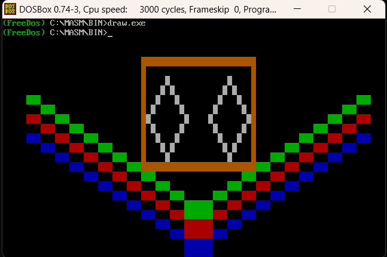
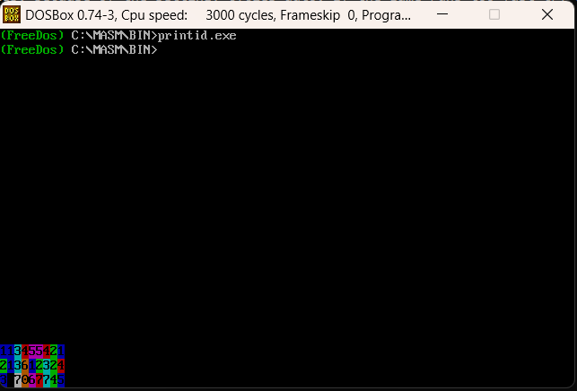

# Assembly Graphics & ID Sum

This project contains two early Assembly exercises that demonstrate **direct video memory access** and **basic arithmetic with visualization** in text mode.

## 1. Colorful Shapes (`draw.asm`)
This program draws simple colorful shapes directly on the screen using text-mode memory (`0xB800` segment).  
It includes:
- A **yellow square**  
- A **grey rhombus**  
- Green, red, and blue lines across the screen  

This exercise shows how to control text-mode graphics by manipulating characters and attributes in video memory.



## 2. ID Addition with Colors (`printid.asm`)
This program prints two student IDs on the screen, digit by digit, and then computes their **digit-wise sum** (like column addition).  
Each digit of the result is printed in a different color, using a predefined color table.

### Features:
- Direct writing to **video memory** (`0xB800`).  
- Loop-based iteration over digits.  
- Handling of **carry** when digit sums exceed 9.  
- Simple **visualization of arithmetic** with colors.



---

## How to Run
1. Open **DOSBox** or a **FreeDOS** environment.  
2. Assemble and link the code with:  
   ```
   ml /Zm printid.asm \ ml /Zm draw.asm
   ```  
3. Run the program by typing:  
   ```
   printid.exe \ draw.exe
   ```  
